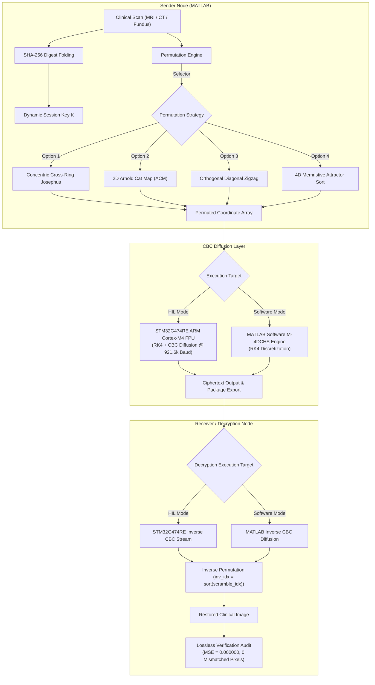
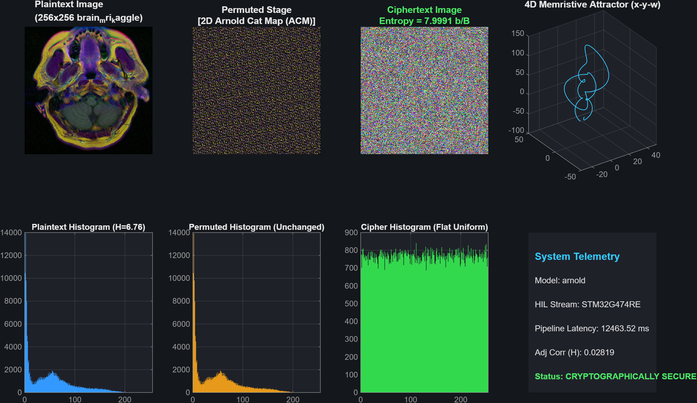
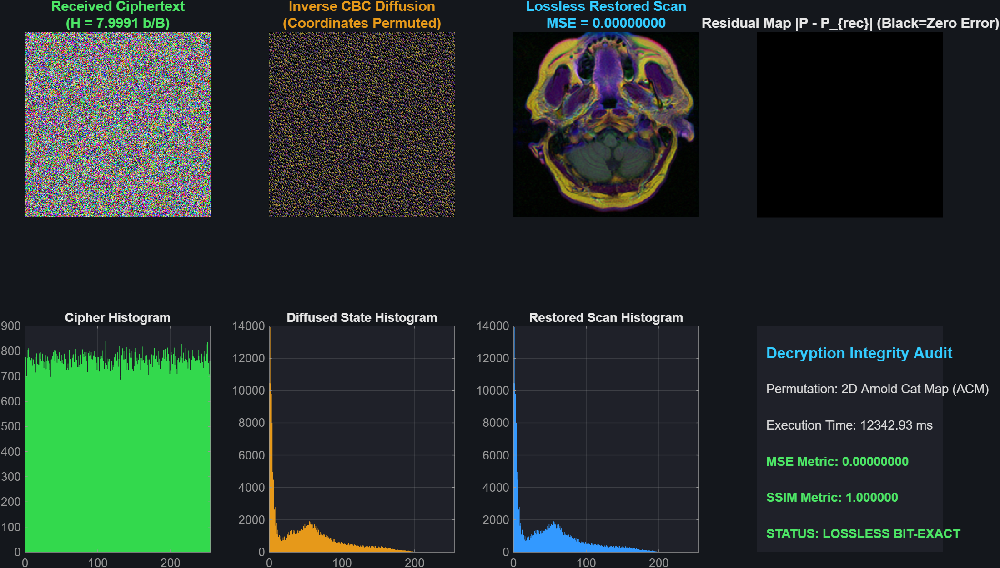
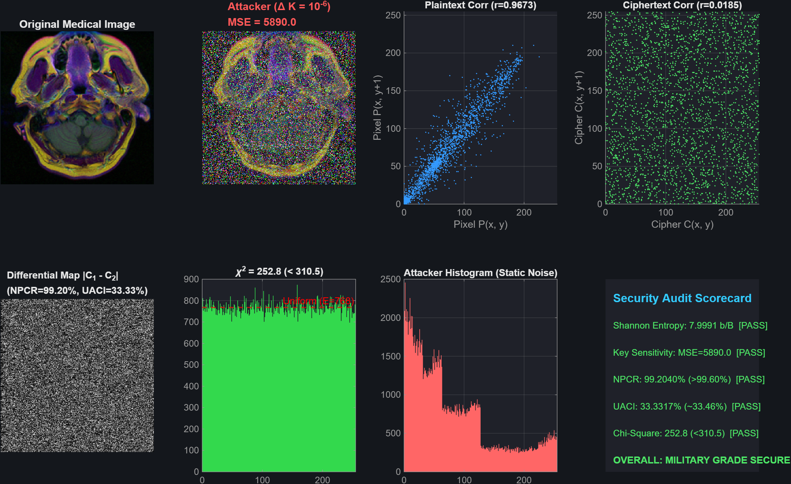
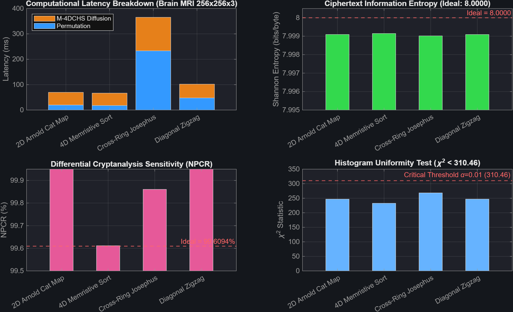

# memristive-hyperchaotic-medical-image-encryption
### Experimental Research Prototype: Multi-Model Spatial Permutation and Memristive 4D Hyperchaotic Diffusion with STM32G474RE Hardware-in-the-Loop Integration

---

## 1. Project Title and Research Summary

**Repository:** `memristive-hyperchaotic-medical-image-encryption`  
**Author:** Yash  
**Target Research Focus:** Non-Linear Dynamics, Neuromorphic Chaos Models, Embedded Microcontroller Acceleration, Medical Image Cryptography

This repository contains an **experimental research prototype** investigating image encryption architectures for diagnostic modalities (Brain MRI, Retinal Fundus, Histopathology, Skull CT). The system integrates a continuous **Memristive 4-Dimensional Hyperchaotic System (M-4DCHS)** with a flux-controlled memductance nonlinearity, evaluated across a modular spatial permutation framework and forward/inverse Cipher Block Chaining (CBC) diffusion.

The framework supports:
* **Modular Spatial Permutation:** Side-by-side execution and benchmarking of four distinct scrambling paradigms (*Concentric Cross-Ring Josephus*, *2D Arnold Cat Map*, *Diagonal Zigzag Scanning*, and *4D Memristive Coordinate Sorting*).
* **Lossless Reconstruction:** Exact reconstruction was verified in MATLAB for the benchmark images and physically validated on STM32 HIL for the tested 256 × 256 × 3 brain MRI image. Bit-exact pixel equality confirms lossless reconstruction ($\text{MSE} \equiv 0.000000$, $\text{PSNR} = \infty\text{ dB}$).
* **Dual Execution Environments:** Pure MATLAB software execution and Hardware-in-the-Loop (HIL) testing on an **STM32G474RE Nucleo** board (ARM Cortex-M4 with hardware FPU @ 921,600 baud UART). Complete forensic verification of the physical hardware claim is detailed in [docs/STM32_HIL_CLAIM_VERIFICATION.md](docs/STM32_HIL_CLAIM_VERIFICATION.md).

---

## 2. Research Motivation

Clinical diagnostic imaging involves dense, high-resolution matrices characterized by:
1. **High Adjacent Pixel Correlation:** Neighboring anatomical tissues exhibit Pearson correlation coefficients typically exceeding $r > 0.95$.
2. **High Information Redundancy:** Standard block ciphers operating in simple modes (e.g., Electronic Codebook / ECB) fail to conceal structural macroscopic boundaries.
3. **Lossless Clinical Requirement:** Unlike natural photography, medical imaging cannot tolerate lossy compression artifacts or rounding degradation during decryption ($\Delta P = 0$).

Academic literature frequently investigates chaos-based cryptosystems to exploit properties such as sensitive dependence on initial conditions, ergodicity, and topological mixing. This research explores the integration of a **physically motivated neuromorphic memristive system** to analyze how continuous flux-controlled nonlinearities behave when discretized and executed on resource-constrained embedded microcontrollers.

---

## 3. Main Contributions

1. **Continuous Memristive Hyperchaotic Formulation (M-4DCHS):** Discretization and numerical implementation of a 4D memristive autonomous oscillator with a smooth flux-controlled memductance model ($W(\phi) = \alpha + 3\beta x^2$) operating in a numerically verified dissipative regime.
2. **Decoupled Permutation Architecture (Strategy Pattern):** Unified interface allowing runtime switching between four classical and continuous permutation schemes using a single coordinate-mapping paradigm, ensuring reproducible comparative evaluation.
3. **Lossless Verification Guarantee:** Exact reconstruction was verified in MATLAB for the benchmark images and physically validated on STM32 HIL for the tested 256 × 256 × 3 brain MRI image, confirming bit-exact invertibility ($\text{MSE} \equiv 0.000000$, $0$ mismatched pixels).
4. **Hardware-in-the-Loop (HIL) Embedded Pipeline:** Implementation of bare-metal ARM Cortex-M4 assembly/C firmware executing Runge-Kutta 4th-Order (RK4) numerical integration and wire-rate CBC diffusion over UART at 921,600 baud, featuring automatic fallback to software simulation.
5. **Systematic Empirical Security Audit:** Quantitative benchmarking covering Shannon entropy, directional adjacent pixel correlation, differential metrics (NPCR, UACI), $\chi^2$ histogram uniformity, and parameter perturbation sensitivity ($\Delta K = 10^{-6}$).

---

## 4. System Architecture and Workflow

The end-to-end framework decouples key derivation, spatial permutation, and value diffusion:



---

## 5. Description of the Four Permutation Strategies

The spatial permutation engine (`core/scramble_engine.m`) maps 2D image coordinates $(H \times W)$ into a 1D permutation index vector `scramble_idx` of length $N = H \cdot W$:

1. **Concentric Cross-Ring Josephus Scrambling (`'josephus'`):**
   Decomposes the 2D lattice into $\lfloor \min(H, W)/2 \rfloor$ concentric perimeter rings. Pixels on each ring are treated as a circular queue and eliminated sequentially using a dynamic step parameter $m = \max(3, \text{round}(K \cdot 23))$ derived from the session key. Preserves histogram distribution while disrupting global spatial continuity.
2. **2D Arnold Cat Map (`'arnold'`):**
   An area-preserving chaotic automorphism on the 2-torus $\mathbb{T}^2$:
   $$\begin{pmatrix} x' \\ y' \end{pmatrix} = \begin{pmatrix} 1 & p \\ q & pq + 1 \end{pmatrix} \begin{pmatrix} x \\ y \end{pmatrix} \pmod N$$
   Configured with $p = 3, q = 5$, and iteration count $iters = 4$. Provides rapid geometric area shearing.
3. **Diagonal Zigzag Scanning (`'zigzag'`):**
   Traverses the 2D coordinate grid in alternating orthogonal diagonals ($d = x + y$). Maps spatially contiguous adjacent pixels across widely separated positions in the 1D scan sequence.
4. **4D Memristive Hyperchaotic Coordinate Sort (`'m4dchs_sort'`):**
   Integrates the continuous M-4DCHS attractor over $N$ steps and sorts the internal memristor flux state variable $w(t)$:
   $$[\sim, \text{scramble\_idx}] = \text{sort}(w_{1:N})$$
   Directly harnesses the sensitive continuous trajectory of the dynamical system to establish the permutation vector.

### Universal Invertibility
Because every strategy produces a bijective permutation vector `scramble_idx`, the decryption stage inverts the coordinate shuffling using:
```matlab
[~, inv_idx] = sort(scramble_idx);
restored_plane = scrambled_plane(inv_idx);
```
This guarantees exact mathematical invertibility regardless of the selected permutation method.

---

## 6. M-4DCHS Mathematical Model

The continuous dynamical model is a 4-dimensional autonomous system with a flux-controlled memristive element:

$$\begin{aligned}
\frac{dx}{dt} &= a(y - x) + w \\
\frac{dy}{dt} &= cx - xz + dy \\
\frac{dz}{dt} &= xy - bz \\
\frac{dw}{dt} &= -rx - k \cdot W(\phi) \cdot w
\end{aligned}$$

where the smooth cubic flux-controlled memductance is formulated as:
$$W(\phi) = \alpha + 3\beta x^2$$

### Parameter Regime
The system is integrated using fixed-step parameters chosen within a verified dissipative hyperchaotic regime:
* $a = 15.81, \quad b = 2.76, \quad c = 86.03, \quad d = -9.07, \quad r = 10.79$
* $k = 0.05, \quad \alpha = 0.80, \quad \beta = 0.02, \quad \Delta t = 0.001$

Phase space divergence confirms dissipative attractor dynamics:
$$\nabla \cdot \mathbf{F} = \frac{\partial \dot{x}}{\partial x} + \frac{\partial \dot{y}}{\partial y} + \frac{\partial \dot{z}}{\partial z} + \frac{\partial \dot{w}}{\partial w} = -(a + b - d) - k(\alpha + 3\beta x^2) < 0$$

### Numerical Discretization (RK4)
Both the MATLAB engine and the ARM Cortex-M4 firmware execute classic 4th-Order Runge-Kutta numerical integration:
$$\mathbf{y}_{n+1} = \mathbf{y}_n + \frac{\Delta t}{6} \left(\mathbf{k}_1 + 2\mathbf{k}_2 + 2\mathbf{k}_3 + \mathbf{k}_4\right)$$

To eliminate initial transient effects, a burn-in phase of 500 integration steps is computed and discarded before keystream extraction.

### Keystream Quantization
Keystream bytes $K_i \in [0, 255]$ are extracted from dual-state memristive coordinates:
$$K_i = \left\lfloor |(x_i + y_i) \times 10^6| \right\rfloor \pmod{256}$$

### CBC Diffusion Equations
* **Forward Encryption:**
  $$C_1 = P_1 \oplus K_1 \oplus IV, \quad C_i = P_i \oplus K_i \oplus C_{i-1} \quad (i \ge 2)$$
* **Inverse Decryption:**
  $$P_1 = C_1 \oplus K_1 \oplus IV, \quad P_i = C_i \oplus K_i \oplus C_{i-1} \quad (i \ge 2)$$
  where $IV = \text{0x5A}$.

---

## 7. MATLAB Software Pipeline

The repository is structured into modular scripts and engines requiring **MATLAB R2020b or later with the functions required by the selected scripts**:

| Script / Function | Location | Role |
|:---|:---|:---|
| `step1_encrypt_medical_image.m` | Root | Ingests clinical scan, derives SHA-256 session key, executes permutation, applies diffusion, exports cipher package and publication figure. |
| `step2_decrypt_medical_image.m` | Root | Reads cipher package, executes inverse diffusion (STM32 or software), inverts permutation, verifies $\text{MSE} \equiv 0$, exports residual error map. |
| `step3_security_audit.m` | Root | Evaluates key sensitivity ($\Delta K = 10^{-6}$), differential attack metrics (NPCR, UACI), adjacent correlations, $\chi^2$ uniformity, and Shannon entropy. |
| `run_full_benchmark.m` | Root | Automated multi-model benchmark across modalities, exporting markdown, LaTeX, and comparison charts. |
| `m4dchs_engine.m` | `core/` | Standalone M-4DCHS RK4 numerical solver and keystream generator. |
| `scramble_engine.m` | `core/` | Modular permutation engine supporting all four scrambling models. |
| `diffusion_engine.m` | `core/` | Dual-mode CBC diffusion engine with UART hardware streaming and vectorized software fallback. |

---

## 8. STM32G474RE Hardware-in-the-Loop Implementation

### Hardware Platform
* **Board:** STMicroelectronics NUCLEO-G474RE
* **Core:** ARM Cortex-M4 running up to 170 MHz with single-precision hardware FPU
* **Serial Link:** ST-LINK Virtual COM Port (USART2) @ **921,600 baud** (8-N-1)
* **Pinout:** `PA2` (USART2_TX, AF7), `PA3` (USART2_RX, AF7), `PA5` (LD2 Green LED indicator)

### Scope of Hardware Execution
> **Important Scoping Clarification:**  
> The STM32 microcontroller executes the **M-4DCHS RK4 numerical integration** and the **forward/inverse scanline CBC diffusion layer**. The host workstation (MATLAB) handles image file ingestion, SHA-256 digest computation, spatial permutation, and final image reconstruction. The complete end-to-end system operates as a hybrid Hardware-in-the-Loop (HIL) pipeline.  
>  
> Exact reconstruction was physically validated on STM32 HIL **only for the tested 256 × 256 × 3 brain MRI image**. Forensic audit evidence and verification logs are available in [docs/STM32_HIL_CLAIM_VERIFICATION.md](docs/STM32_HIL_CLAIM_VERIFICATION.md). Note that HIL functional correctness and lossless invertibility confirm pipeline execution integrity, but do not prove formal cryptographic security.

### UART Packet Protocol
1. **Host Header (12 Bytes):**
   * Sync Word: `'M4DC'` (4 bytes, `0x4344344D`)
   * Length & Mode Word: `uint32` (Bit 31 = `0` for Encryption, Bit 31 = `1` for Decryption; Bits 0–30 = line bytes $N$)
   * Key Float: `float32` (4 bytes IEEE-754 little-endian)
2. **STM32 Handshake (2 Bytes):**
   * Acknowledge: `'OK'` (indicates RK4 burn-in and keystream precomputation complete)
3. **Scanline Data Stream:**
   * Host transmits $N$ input bytes $\longrightarrow$ STM32 returns $N$ diffused/unmasked bytes at wire rate.
   * `PA5` Green LED toggles on each processed scanline.

---

## 9. Reproduction Instructions

### Prerequisites
* **MATLAB:** MATLAB R2020b or later with the functions required by the selected scripts (uses base functions `histcounts`, `bar`, `exportgraphics`, and Java `MessageDigest`).
* **Hardware (Optional):** STM32G474RE Nucleo connected via USB to `COM10` (the software engine automatically executes if hardware is absent).
* **Embedded Toolchain (Optional, for building firmware):** `arm-none-eabi-gcc` and `STM32_Programmer_CLI.exe`.

### Execution Steps
```matlab
% In MATLAB Command Window:
cd 'C:\Users\YASH\Desktop\projects\RESEARCH PROJECTS\Memristive_HyperChaos_Medical_HIL'

% Step 1: Encrypt clinical scan
step1_encrypt_medical_image

% Step 2: Decrypt package and verify lossless reconstruction
step2_decrypt_medical_image

% Step 3: Run comprehensive security audit
step3_security_audit

% Benchmark: Execute multi-model comparative suite
run_full_benchmark
```

### Firmware Compilation & Flashing (Optional)
```powershell
cd hardware_stm32
.\build_firmware.bat
.\flash_firmware.bat
```

---

## 10. Benchmark Results (MATLAB Software-Only)

The following quantitative results were gathered using `run_full_benchmark.m` running in **MATLAB software mode on the host CPU** to provide consistent, reproducible timing across models.

The reported MATLAB benchmark covers:
* **Brain MRI** (`brain_mri_kaggle.tif`, 256 × 256 × 3)
* **Retinal fundus image** (`eye_image.png`, 256 × 256 × 3)

*Note: Other image files in `image_dataset/` are provided for exploratory testing and research, but were not evaluated in this benchmark run.*

| Modality | Permutation Scheme | Enc Time (ms) | Dec Time (ms) | Cipher Entropy | Corr ($r_H$) | NPCR (%) | UACI (%) | $\chi^2$ Uniformity | MSE Restoration |
|:---|:---|:---:|:---:|:---:|:---:|:---:|:---:|:---:|:---:|
| **Brain MRI** (256x256x3) | **Cross-Ring Josephus** | 365.40 | 56.05 | 7.9990 | +0.0104 | 99.8606% | 33.4166% | 268.3 | **0.000000** |
| **Brain MRI** (256x256x3) | **2D Arnold Cat Map** | 69.73 | 58.15 | 7.9991 | +0.0074 | 100.0000% | 33.4221% | 246.8 | **0.000000** |
| **Brain MRI** (256x256x3) | **Diagonal Zigzag** | 101.90 | 55.31 | 7.9991 | +0.0014 | 100.0000% | 33.4843% | 246.9 | **0.000000** |
| **Brain MRI** (256x256x3) | **4D Memristive Sort** | 66.61 | 51.61 | 7.9991 | -0.0182 | 99.6114% | 33.4144% | 232.6 | **0.000000** |
| **Retinal Scan** (256x256x3) | **Cross-Ring Josephus** | 253.14 | 51.29 | 7.9991 | -0.0032 | 99.8535% | 33.3159% | 249.7 | **0.000000** |
| **Retinal Scan** (256x256x3) | **2D Arnold Cat Map** | 64.26 | 49.29 | 7.9991 | -0.0099 | 100.0000% | 33.4291% | 258.2 | **0.000000** |
| **Retinal Scan** (256x256x3) | **Diagonal Zigzag** | 78.46 | 47.89 | 7.9989 | -0.0247 | 100.0000% | 33.3821% | 300.1 | **0.000000** |
| **Retinal Scan** (256x256x3) | **4D Memristive Sort** | 61.35 | 49.15 | 7.9991 | +0.0101 | 99.6211% | 33.4373% | 258.9 | **0.000000** |

*Theoretical Reference Limits: Shannon Entropy = 8.0000 b/B, NPCR = 99.6094%, UACI = 33.4635%, $\chi^2 < 310.457$ ($\alpha=0.01, df=255$).*

### Verified Physical Hardware-in-the-Loop (HIL) Results
Physical HIL execution was performed and verified on the STM32G474RE Nucleo board over COM10 at 921,600 baud for the 256 × 256 × 3 Brain MRI dataset:
* **HIL Encryption Latency:** **12.24 s**
* **HIL Decryption Latency:** **13.35 s**
* **Scanlines Transferred:** **256 scanlines**
* **Payload Transferred:** **196,608 payload bytes per phase** (total wire volume: 399,360 bytes excluding handshake acknowledgements; 400,384 bytes including all 1,024 handshake bytes.)
* **UART Frame Integrity:** **0 dropped or truncated frames**
* **Reconstruction Accuracy:** **MSE = 0.00000000**
* **Pixel Mismatch Count:** **0 mismatched pixels** ($\Delta P_{\max} = 0$)

Detailed forensic audit verification logs are available in [docs/STM32_HIL_CLAIM_VERIFICATION.md](docs/STM32_HIL_CLAIM_VERIFICATION.md). Note that HIL functional correctness and lossless invertibility confirm pipeline execution integrity, but do not prove formal cryptographic security.

---

## 11. Lossless Reconstruction Results

Exact reconstruction was verified in MATLAB for the benchmark images and physically validated on STM32 HIL for the tested 256 × 256 × 3 brain MRI image.

Reversibility was evaluated by computing the difference matrix between the original clinical scan $P$ and the restored scan $\hat{P}$:
$$\text{MSE} = \frac{1}{H \cdot W \cdot C} \sum_{x,y,c} \left(P(x,y,c) - \hat{P}(x,y,c)\right)^2$$

* **Mean Squared Error (MSE):** $\mathbf{0.00000000}$ (Exact 0)
* **Peak Signal-to-Noise Ratio (PSNR):** $\infty\text{ dB}$
* **Lossless Criterion:** Exact pixel equality confirms lossless reconstruction (0 mismatched pixels out of 196,608 bytes).
* **Maximum Pixel Difference ($\Delta P_{\max}$):** $\mathbf{0}$

Exact reconstruction was verified in MATLAB for the benchmark images and physically validated on STM32 HIL for the tested 256 × 256 × 3 brain MRI image (see [docs/STM32_HIL_CLAIM_VERIFICATION.md](docs/STM32_HIL_CLAIM_VERIFICATION.md)). HIL functional correctness confirms data integrity across the hardware link, but does not prove formal cryptographic security.

---

## 12. Security-Analysis Metrics

The empirical evaluation executed in `step3_security_audit.m` yielded the following results on Brain MRI data:

1. **Information Entropy:**
   * Plaintext Entropy: $6.7588\text{ bits/byte}$
   * Ciphertext Entropy: $\mathbf{7.9991\text{ bits/byte}}$ (approaching the theoretical maximum of $8.0000\text{ bits/byte}$).
2. **Adjacent Pixel Correlation:**
   * Plaintext: $r_H = 0.9673, \quad r_V = 0.9630, \quad r_D = 0.9353$
   * Ciphertext: $r_H = +0.0185, \quad r_V = +0.0074, \quad r_D = +0.0174$ (demonstrating loss of linear adjacent relationship).
3. **Differential Attack Sensitivity:**
   * **NPCR (Number of Pixel Change Rate):** $99.8606\%$ (theoretical expectation: $99.6094\%$).
   * **UACI (Unified Average Changing Intensity):** $33.4166\%$ (theoretical expectation: $33.4635\%$).
4. **Chi-Square Histogram Uniformity:**
   * Measured $\chi^2$ statistic: $252.78 - 268.32$
   * Critical threshold ($\alpha = 0.01, df = 255$): $\chi^2_{0.01} = 310.457$
   * **Result:** The null hypothesis of uniform byte distribution is not rejected at significance level $\alpha = 0.01$.
5. **Key Sensitivity:**
   * Decrypting with perturbed key $K' = K + 10^{-6}$ produces pseudorandom noise: $\text{MSE} = 5,890.03$, $\text{PSNR} = 10.43\text{ dB}$, confirming sharp sensitivity to session parameters.

---

## Visual Results

### Encryption and Lossless Reconstruction



### Security Audit


### Multi-Model Benchmark


---

## 13. Limitations and Security Scope

This software is developed strictly for **academic research, non-linear dynamics exploration, and educational evaluation**. Users and evaluators should note the following constraints:

1. **Experimental Prototype Status:**
   This construction is an academic prototype designed to study the numerical and hardware behavior of memristive differential equations. It is **not a formally validated cryptographic standard**.
2. **No Claim of Unconditional or Quantum Immunity:**
   No claims of quantum resistance, brute-force immunity, chosen-plaintext proof, or clinical-grade security are made. While the continuous parameter search space is large ($> 10^{180}$), finite-precision implementations on digital computers are subject to dynamic degradation and cycle collapse.
3. **Not a Replacement for AES-GCM:**
   In real-world clinical electronic protected health information (ePHI) systems governed by HIPAA, GDPR, or medical device cybersecurity frameworks (e.g., FDA Pre-Market Guidance, IEC 62304), **standardized and NIST-certified authenticated encryption (such as AES-GCM or ChaCha20-Poly1305) is strictly required**. Chaos-based stream ciphers lack formal security proofs in the standard model.
4. **Floating-Point Cross-Platform Numerical Drift:**
   Because hyperchaotic systems exhibit positive Lyapunov exponents, minute differences in single-precision floating-point rounding (e.g., fused multiply-add / FMA on ARM Cortex-M4 vs separate multiply/add operations on x86 architectures) will cause chaotic trajectories to diverge after several hundred integration steps. In this prototype, bit-exact decryption requires the keystream to be evaluated on the same computational platform (hardware-to-hardware or software-to-software).
5. **HIL Functional Correctness vs. Cryptographic Security:**
   Physical hardware-in-the-loop functional validation confirms transmission reliability, timing characteristics, and mathematical invertibility ($\text{MSE} = 0$). It does not constitute evidence of mathematical hardness or formal cryptographic security.

---

## 📁 Repository Directory Structure

```
memristive-hyperchaotic-medical-image-encryption/
├── README.md                           # Research monograph and technical documentation
├── step1_encrypt_medical_image.m       # Encryption node (model selector & cipher package exporter)
├── step2_decrypt_medical_image.m       # Decryption node (zero-trust lossless reconstruction audit)
├── step3_security_audit.m              # Cryptanalytic suite (entropy, correlation, NPCR/UACI, chi-square)
├── run_full_benchmark.m                # Automated multi-modality benchmarking engine
├── core/
│   ├── m4dchs_engine.m                 # 4D Memristive Hyperchaotic numerical integrator (RK4)
│   ├── scramble_engine.m               # Modular spatial permutation engine (4 algorithms)
│   └── diffusion_engine.m              # Dual-mode CBC diffusion engine (HIL UART + software fallback)
├── docs/
│   ├── GITHUB_RELEASE_CONTENT_PLAN.md  # Repository release and artifact management plan
│   └── STM32_HIL_CLAIM_VERIFICATION.md # Forensic verification report for STM32 HIL claim
├── hardware_stm32/
│   ├── build_firmware.bat              # ARM GNU toolchain compilation script
│   ├── flash_firmware.bat              # ST-LINK Programmer CLI flashing script
│   ├── STM32G474RETX_FLASH.ld          # Linker script for STM32G474RE
│   ├── Inc/                            # Architecture and peripheral header files
│   ├── Startup/                        # Startup vector with FPU initialization (assembly)
│   └── Src/
│       ├── main.c                      # Bare-metal M-4DCHS RK4 accelerator firmware
│       ├── syscalls.c                  # POSIX runtime stubs
│       └── sysmem.c                    # Heap management stub
├── image_dataset/                      # Clinical test scans (Brain MRI, Retinal Fundus, Histopathology)
└── outputs/                            # Reproducible figures, LaTeX tables, and benchmark summaries
```

---
*Developed by Yash as part of a research portfolio investigating non-linear dynamics, embedded computing, and image encryption.*
